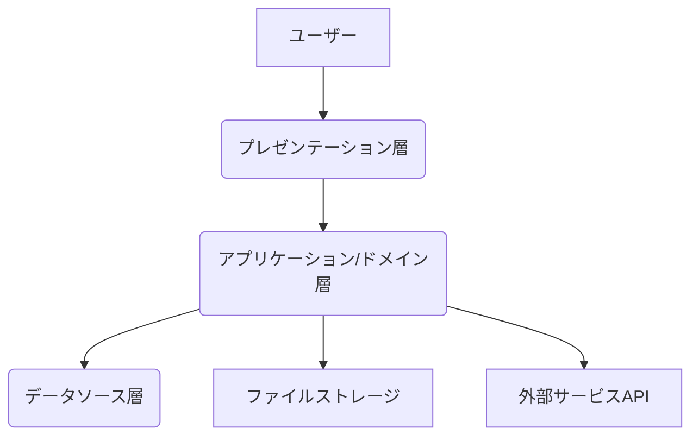

# ES業務フロー エンジニア向け技術定義

## 1. はじめに

この文書は、ES業務フローのシステム実装を行うエンジニア向けに、システム構成、技術スタック、開発環境、開発プロセスに関する基本的な指針を提供するものです。

## 2. システム構成案

本システムは、以下の三層アーキテクチャをベースとすることを想定します。

*   **プレゼンテーション層 (クライアントサイド):** ユーザーインターフェースを提供します。
*   **アプリケーション/ドメイン層 (サーバーサイド):** ビジネスロジック、データの処理、外部サービスとの連携を行います。
*   **データソース層 (データベース):** データの永続化を担います。

必要に応じて、ファイルストレージ（調査時の写真など）や外部API連携のための層が追加される可能性があります。

## 3. 技術スタック候補

以下の技術スタックが考えられます。プロジェクトの要件、チームの経験、保守性、スケーラビリティなどを考慮して選択・決定します。

### 3.1. フロントエンド (プレゼンテーション層)

*   **言語:** TypeScript
*   **フレームワーク/ライブラリ候補:**
    *   React
    *   Vue.js
    *   Angular
*   **状態管理候補:** (フレームワークによる)
    *   React: Recoil, Zustand, Redux Toolkitなど
    *   Vue.js: Vuex, Pinia
    *   Angular: RxJS, Ngrx
*   **UIライブラリ候補:** Material UI, Ant Design, Bootstrapなど
*   **ビルドツール:** Webpack, Viteなど

### 3.2. バックエンド (アプリケーション/ドメイン層)

*   **言語/フレームワーク候補:**
    *   Node.js (Express, NestJS)
    *   Python (Django, Flask, FastAPI)
    *   Ruby on Rails
    *   Java (Spring Boot)
    *   Go
*   **API形式:** RESTful API または GraphQL
*   **認証・認可:** JWT, OAuth2.0など

### 3.3. データベース (データソース層)

データエンティティ定義に基づき、リレーショナルデータベースが適しています。

*   **データベースシステム候補:**
    *   PostgreSQL (推奨)
    *   MySQL
    *   SQLite (小規模な場合やプロトタイプ)
*   **ORM (Object-Relational Mapping) 候補:** (言語/フレームワークによる)
    *   Node.js: Sequelize, TypeORM, Prisma
    *   Python: Django ORM, SQLAlchemy
    *   Ruby on Rails: ActiveRecord
    *   Java: Hibernate, JPA

### 3.4. インフラストラクチャ

クラウドプラットフォームの利用を想定します。

*   **クラウドプロバイダー候補:** AWS, GCP, Azure
*   **主要サービス例 (AWSの場合):**
    *   Compute: EC2, Lambda, Fargate
    *   Database: RDS (PostgreSQL/MySQL)
    *   Storage: S3 (ファイルストレージ)
    *   Networking: VPC, Route 53, ALB
    *   CI/CD: CodeCommit, CodeBuild, CodeDeploy, CodePipeline (またはGitHub Actions, GitLab CI)

## 4. 開発環境

*   **OS:** 開発チーム内で統一または主要なOS（Windows, macOS, Linux）をサポート
*   **IDE:** 各自の好みに応じる（VS Code推奨など）
*   **バージョン管理システム:** Git
*   **ホスティングサービス:** GitHub, GitLab, Bitbucketなど
*   **パッケージマネージャー:** (技術スタックによる) npm, yarn, pip, Bundlerなど
*   **コンテナ:** Docker (開発環境の統一、デプロイの簡素化に利用を検討)

## 5. 開発プロセス・規約

*   **ブランチ戦略:** Git Flow または GitHub Flow など、明確なブランチ運用ルールを定める。
*   **コーディング規約:** 各言語・フレームワークの標準的な規約に準拠。ESLint, Prettier, Blackなどのリンター、フォーマッターを導入し、コードの品質と統一性を保つ。
*   **コードレビュー:** Pull Request/Merge Request ベースでのコードレビューを必須とする。
*   **テスト:**
    *   単体テスト (Unit Test): 各コンポーネント、関数の単体テスト。
    *   結合テスト (Integration Test): モジュール間の連携テスト。
    *   E2Eテスト (End-to-End Test): ユーザーシナリオに基づいたシステム全体のテスト。
*   **ドキュメンテーション:** API仕様書 (Swagger/OpenAPI)、主要機能の設計意図などを記述する。

## 6. 今後の検討事項

*   具体的なフレームワーク、ライブラリの最終決定と選定理由の明確化。
*   より詳細なインフラ設計（スケーラビリティ、可用性、セキュリティ）。
*   セキュリティ対策の詳細化（認証、認可、入力値検証など）。
*   エラーハンドリング、ログ収集、監視設計。
*   CI/CDパイプラインの構築詳細。
*   非機能要件（パフォーマンス、負荷分散など）の詳細設計。
*   **認証・認可:** ログインIDとして社員番号を使用する実装。役割（ロール）に基づいたアクセス制御の実装。初期パスワード強制変更の実装。
